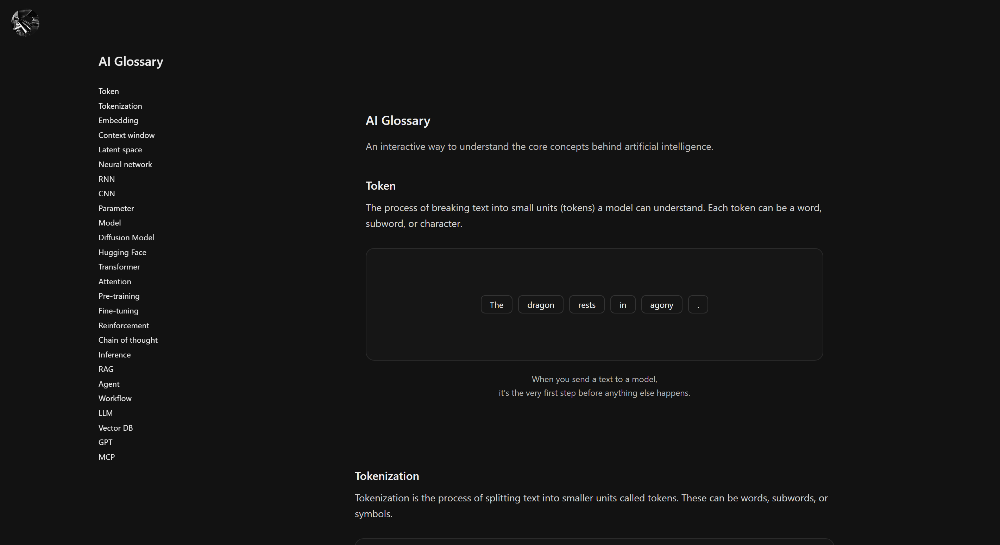
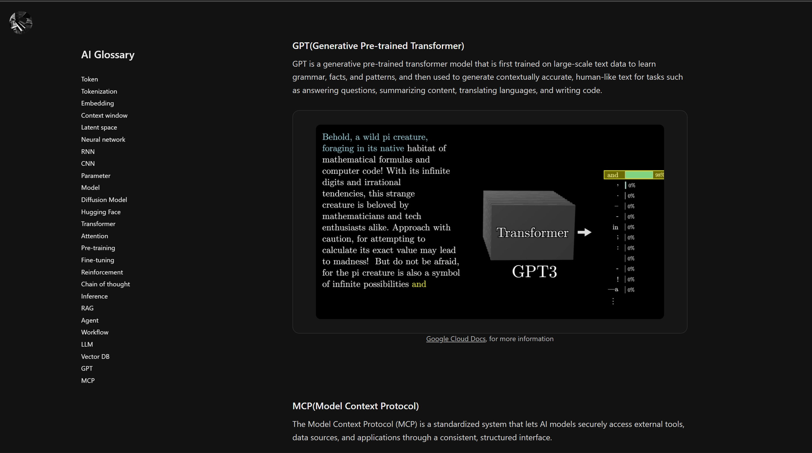

# AI Glossary

An interactive minimalistic web application designed to provide clear and concise explanations of common Artificial Intelligence terms and concepts. Built with Next.js and TypeScript.

## Features

- **Interactive Glossary:** Browse a curated list of AI terms.
- **Visual Explanations:** Each term is explained with text, images, and even video clips for better understanding.
- **Modern UI:** A clean and easy-to-navigate interface.
- **Responsive Design:** Works on all devices.

## Screenshots





## Technologies Used

- [Next.js](https://nextjs.org/) - React Framework
- [React](https://reactjs.org/) - UI Library
- [TypeScript](https://www.typescriptlang.org/) - Typed JavaScript
- [Tailwind CSS](https://tailwindcss.com/) - CSS Framework

## Getting Started

Follow these instructions to get a copy of the project up and running on your local machine for development and testing purposes.

### Prerequisites

You need to have [Node.js](https://nodejs.org/en/) and [npm](https://www.npmjs.com/) installed on your machine.

### Installation

1.  **Clone the repository:**

    ```bash
    git clone https://github.com/your-username/aiglossary.git
    cd aiglossary
    ```

2.  **Install dependencies:**

    ```bash
    npm install
    ```

3.  **Run the development server:**
    ```bash
    npm run dev
    ```

Open [http://localhost:3000](http://localhost:3000) with your browser to see the result.
